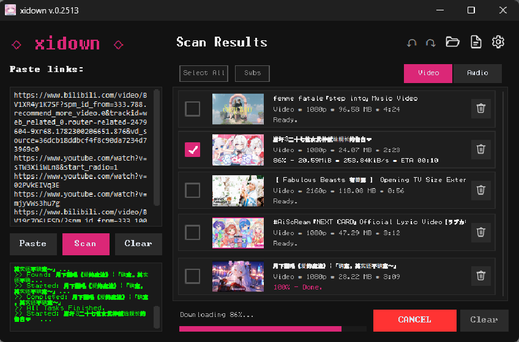

# xidown

xidown is a powerful, cross-platform GUI-based video and audio downloading application built with Python. Designed with an aesthetic dark-themed UI (CustomTkinter), xidown enables users to effortlessly scan, preview, and download media using `yt-dlp` and `ffmpeg`.



## Features

- **Modern & Premium UI:** Built with CustomTkinter for a sleek, dark-themed experience with fluid animations and crisp, clean layouts.
- **Interactive Video Queue (Drag & Drop):** Seamlessly reorder scanned videos in your download list by simply dragging and dropping the video cards. 
- **Advanced Context Menus:** Right-click on any video card to access quick actions:
  - **Pin/Unpin:** Lock a video to the top of your list so it doesn't get cleared accidentally.
  - **Test Play (15s):** Quickly preview the video directly from the UI before fully downloading it.
  - **Download Item:** Force download a specific item instantly without waiting for the batch queue.
  - **Delete:** Remove a specific video from the queue.
- **Intelligent Playlist Guard:** Automatically detects when you paste a massive playlist and prompts a confirmation dialog to prevent accidental UI overloads.
- **Cross-Platform Support:** Works seamlessly on Windows, Linux, and macOS (with native macOS right-click bindings).
- **Batch Processing & Multithreading:** Scan playlists or multiple links, and download them simultaneously using custom thread and parallel job limits.
- **Browser Extension Integration:** Built-in Maribel Server (Flask-based) runs silently on port 3000 to instantly catch download links from the companion browser extension.
- **Smart Cookie Management:** Seamlessly import Netscape-formatted cookies per domain (e.g., YouTube, Bilibili) to bypass age-restrictions and login walls. Includes API spoofing to bypass YouTube's strict JS runtime requirements.
- **Subtitle Selection:** Choose specific subtitle languages (native or auto-generated) before downloading.
- **Smart Caching Engine:** Automatically caches video thumbnails and includes a built-in "Cleaner Manager" to easily wipe junk or broken partial downloads in one click.
- **History Tracking & Session Recovery:** Easily undo/redo actions in your scan list, and remember previously scanned items across sessions.

## Prerequisites

- Python 3.8+
- **`ffmpeg` and `yt-dlp`:** The application requires these dependencies to scan and download media. Xidown detects system PATH executables automatically. If missing, setup behaves as follows per OS:
  - **Windows (Automatic):** The application will prompt to download and place `yt-dlp.exe` and `ffmpeg.exe` automatically in the local `bin/` directory.
  - **Linux (Manual):** Install via your package manager, e.g., for Debian/Ubuntu:
    ```bash
    sudo apt update && sudo apt install ffmpeg yt-dlp
    ```
  - **macOS (Manual):** Install via Homebrew:
    ```bash
    brew install ffmpeg yt-dlp
    ```

## Installation & Setup

You can either download the pre-built standalone binaries or set up the project from source.

### Option 1: Standalone Release (Recommended for Users)

Download the latest pre-compiled package for your OS (Windows, Linux, macOS) from the [Releases](https://github.com/indravoyager/xidown/releases) page.

1. Download and extract the `.zip` file for your platform.
2. Run the executable:
   - **Windows:** Double-click `xidown.exe` or run `xidown.exe` in CMD/PowerShell. *(Note: On Windows, xidown will automatically prompt to download and place `ffmpeg.exe` and `yt-dlp.exe` in the local `bin/` directory if they are not in your system PATH).*
   - **Linux / macOS:** Open a terminal, make it executable (`chmod +x xidown`), and run `./xidown`. *(Note: You must have `ffmpeg` and `yt-dlp` installed on your system).*

---

### Option 2: Installation from Source (For Developers)

xidown is structured as a standard Python package. It is recommended to install it inside a Python virtual environment to keep dependencies isolated.

1. **Clone the repository:**
   ```bash
   git clone https://github.com/indravoyager/xidown.git
   cd xidown
   ```

2. **Create a Python virtual environment:**
   ```bash
   python -m venv venv
   ```

3. **Activate the virtual environment:**
   - **Windows (Command Prompt):**
     ```cmd
     venv\Scripts\activate.bat
     ```
   - **Windows (PowerShell):**
     ```powershell
     venv\Scripts\Activate.ps1
     ```
   - **Linux / macOS:**
     ```bash
     source venv/bin/activate
     ```

4. **Install the package in editable mode:**
   ```bash
   pip install -e .
   ```
   *(This automatically installs core dependencies like `customtkinter`, `Flask`, `flask-cors`, and `Pillow` inside the active environment).*

## Browser Extension Setup

To enable seamless download link catching directly from your browser, you will need the companion browser extension:

1. Download or clone the extension from its repository: [xidown_ext](https://github.com/indravoyager/xidown_ext)
2. Open your Chromium-based browser (Chrome, Edge, Brave).
3. Navigate to the extensions page: `chrome://extensions/` or `edge://extensions/`.
4. Enable **Developer mode** in the top right corner.
5. Click **"Load unpacked"** and select the folder where you extracted the `xidown_ext` files.
6. Once loaded, the extension will automatically send detected video links to xidown's Maribel server (port 3000) whenever xidown is running.

## Usage

Since xidown is installed as a package, you can run it from **any directory** in your terminal:

```bash
xidown
```

Alternatively, for development testing, you can run it directly from the project root:
```bash
python -m xidown
```

- **Scan:** Paste your video link(s) and click **Scan** to retrieve metadata.
- **Download:** Select the desired format (Video/Audio) and click **Download**.
- **Settings:** Configure threads, proxy, download quality, and default save paths from the settings panel.

## Project Structure

```text
xidown/
├── assets/              # Icons and image resources
├── bin/                 # Auto-downloaded yt-dlp and ffmpeg executables (if missing from PATH)
├── data/                # Database, caches, and configuration memory
├── xidown/              # Core Python package
│   ├── app.py           # Main application entry point & Flask Server
│   ├── core/            # Download logic, scanning algorithms, and system utilities
│   └── gui/             # CustomTkinter UI layouts, popups, and components
├── pyproject.toml       # Python package configuration and dependencies
└── README.md
```

## Contributing

Pull requests are welcome. For major changes, please open an issue first to discuss what you would like to change.

## License

[MIT](https://choosealicense.com/licenses/mit/)
